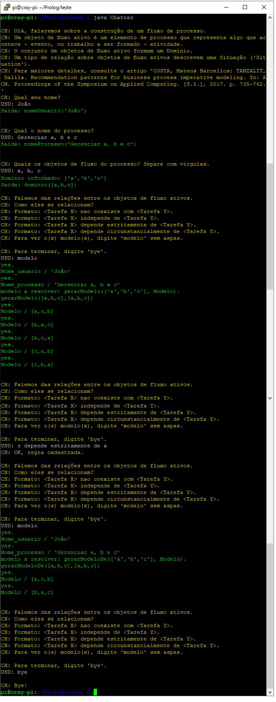

# IA_201901
Trabalho 4 da matéria de IA - semestre 01/2019.

Metas do projeto:
- Utilizar lógica de primeira ordem para geração de sentenças declarativas de requisitos de negócio baseadas nos "padrões de recomendação" proposto por Costa e Tamzalit (2017);
- Verificar a assertividade dos modelos gerados.

Abordagem básica:
- A partir de sentenças previamente descritas, executar transformações para obtenção das estruturas declarativas.

Resultados previstos:
- Obter os modelos declarativos resultantes de um conjunto de descrições estruturadas de processos de negócio.

Bibliografia:

DUMAS, Marlon et al. Fundamentals of business process management. [S.l.]: Springer, 2013. v.1

COSTA, Mateus Barcellos; TAMZALIT, Dalila. Recommendation patterns for business process imperative modeling. In: ACM. Proceedings of the Symposium on Applied Computing . [S.l.], 2017. p. 735–742

AA, H. van der et al. Extracting declarative process models from natural language. In:SPRINGER. International Conference on Advanced Information Systems Engineering.[S.l.], 2019. p. 365–382

FAVERO, Eloi Luiz. Programação em Prolog.Http://Favero.Ufpa.Br/Capmain2006.Pdf, p. 235–242, 2006. Disponível em: <http://favero.ufpa.br/capmain2006.pdf>.

O modelo de template de conferência utilizado é da AAAI.

Os fontes estão no diretório source.
Para executar:
- Você precisa ter o java 8 instalado na máquina. Verifique digitando o comando abaixo:
```sh
java -version
```
- Você precisa do tuProlog, arquivo 2p-4.0.0.jar presente em  http://apice.unibo.it/xwiki/bin/view/Tuprolog/WebHome
- Extraia o conteúdo do arquivo 2p-4.0.0.jar no mesmo diretório dos arquivos presentes em source
- Execute o comando abaixo para compilar:
javac Chatter.java
- Execute o comando abaixo para executar:
java Chatter


Abaixo imagem da execução do Chatterbot. O texto em <span style="color: yellow">amarelo</span> é a 'fala' do Chatterbot CH, em branco as falas do usuário USU e em <span style="color: green">verde</span> as execuções relacionadas à lógica do Prolog:



